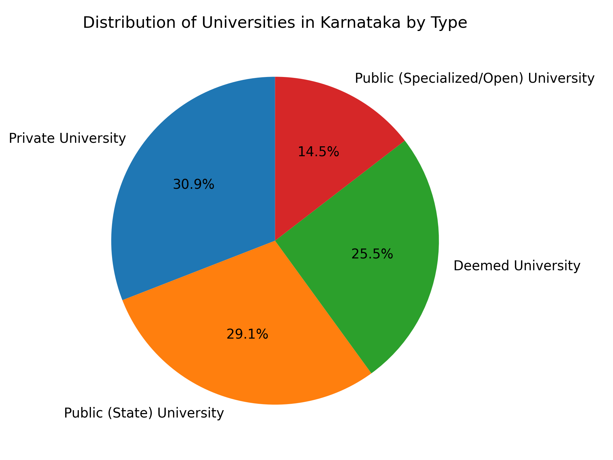

# Karnataka Universities Data Analysis

## Project Overview
This project analyzes the distribution and characteristics of universities in Karnataka, India. The dataset contains information about 55 universities categorized by their type (Public State, Public Specialized/Open, Private, and Deemed).

**Data Source:** [Karnataka University Data - data.gov.in](https://www.data.gov.in/catalog/karnataka-university-data)

---

## Q&A with Insights

### Q1: How many universities are there in Karnataka?

**Answer:** There are **55 universities** in Karnataka.

**Code:**
```python
import pandas as pd
import numpy as np

# Read the CSV file
karnataka_universities = pd.read_csv('List_University_Karnataka.csv')

# Count total universities
total_universities = karnataka_universities.count()
print(total_universities)
```

**Output:**
```
Name_of_University    55
Type_of_University    55
dtype: int64
```

---

### Q2: What types of universities exist in Karnataka and how are they distributed?

**Answer:** Karnataka has four types of universities with the following distribution:
- **Private Universities**: 17 (30.9%)
- **Public (State) Universities**: 16 (29.1%)
- **Deemed Universities**: 14 (25.5%)
- **Public (Specialized/Open) Universities**: 8 (14.5%)

**Code:**
```python
# Map abbreviations to full names
type_mapping = {
    'PA': 'Public (State) University',
    'PN': 'Public (Specialized/Open) University',
    'HP': 'Private University',
    'D': 'Deemed University'
}

karnataka_universities['Type_of_University'] = (
    karnataka_universities['Type_of_University'].map(type_mapping)
)

# Count by type
type_counts = karnataka_universities['Type_of_University'].value_counts()
print(type_counts)
```

**Output:**
```
Type_of_University
Private University                        17
Public (State) University                 16
Deemed University                         14
Public (Specialized/Open) University       8
Name: count, dtype: int64
```

---

### Q3: How can we visualize the distribution of universities by type?

**Answer:** A pie chart provides a clear visualization of the proportional distribution of university types in Karnataka, showing that Private and Public State universities together account for 60% of all universities.



**Code:**
```python
import matplotlib.pyplot as plt

# Create pie chart
type_counts = karnataka_universities['Type_of_University'].value_counts()

plt.figure()
type_counts.plot(
    kind='pie',
    autopct='%1.1f%%',  # shows percentages
    startangle=90       # rotates for better view
)
plt.title('Distribution of Universities in Karnataka by Type')
plt.ylabel('')  # removes default y-label
plt.tight_layout()
plt.show()
```

---

### Q4: What data preprocessing and cleaning steps were performed?

**Answer:** The following preprocessing steps were applied:

**In Excel:**
1. **Removed unwanted columns** - Deleted columns containing `????????????` type values that were not useful for analysis

**In Python:**
1. **Removed the `slno` column** - Serial numbers are not needed for analysis
2. **Renamed university types** - Changed abbreviations (PA, PN, HP, D) to full descriptive names for better readability

**Code:**
```python
# Remove slno column
karnataka_universities = karnataka_universities.drop('slno', axis=1)

# Update type naming convention
type_mapping = {
    'PA': 'Public (State) University',
    'PN': 'Public (Specialized/Open) University',
    'HP': 'Private University',
    'D': 'Deemed University'
}

karnataka_universities['Type_of_University'] = (
    karnataka_universities['Type_of_University'].map(type_mapping)
)
```

---

### Q5: What are some notable universities in each category?

**Answer:** 

**Public (State) Universities:**
- Bangalore University, Bangalore
- University of Mysore, Mysore
- Vesveswaraiah Technological University, Belgaum

**Private Universities:**
- Azim Premji University, Bangalore
- PES University, Bangalore
- Dayananda Sagar University

**Deemed Universities:**
- Indian Institute of Science, Bangalore
- Christ University, Bangalore
- Manipal Academy of Higher Education, Manipal

**Public (Specialized/Open) Universities:**
- Karnataka State Open University, Mysore
- Kannada University, Hampi

**Code:**
```python
# View first few rows
print(karnataka_universities.head())

# View last few rows
print(karnataka_universities.tail())

# View all universities by filtering by type
public_state = karnataka_universities[
    karnataka_universities['Type_of_University'] == 'Public (State) University'
]
print(public_state)
```

---

## Key Insights

1. **Balanced Public-Private Mix**: Karnataka has a relatively balanced distribution between public (44.0%) and private/deemed (56.0%) universities.

2. **Private Sector Leadership**: Private universities (30.9%) represent the largest single category, indicating significant private sector investment in higher education.

3. **Specialized Education Focus**: 8 universities are dedicated to specialized or open education, catering to specific domains like Sanskrit, Music, Economics, and distance learning.

4. **Major Education Hubs**: Cities like Bangalore/Bengaluru and Mysore have multiple universities, establishing them as major education centers in the state.

---

## Dataset Information

**Columns:**
- `Name_of_University`: Official name of the university with location
- `Type_of_University`: Category of the university

**Total Records:** 55

---

## Technologies Used
- Python 3.x
- pandas
- numpy
- matplotlib

---

## How to Run

1. Install required libraries:
```bash
pip install pandas numpy matplotlib
```

2. Download the dataset from [data.gov.in](https://www.data.gov.in/catalog/karnataka-university-data)

3. Place the CSV file in your working directory

4. Run the analysis in Jupyter Lab or Jupyter Notebook

---

## Note
Make sure to save your pie chart visualization as `distribution_chart.png` in the same directory as this README for proper image display.
